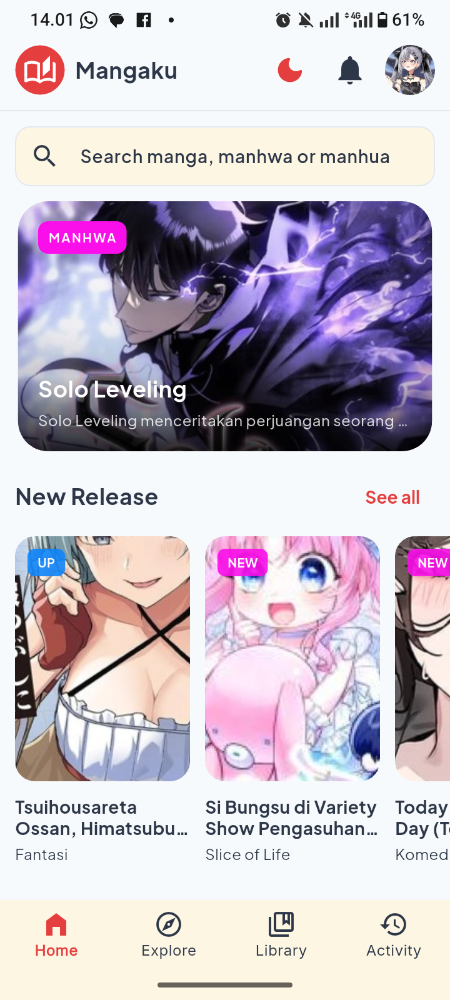
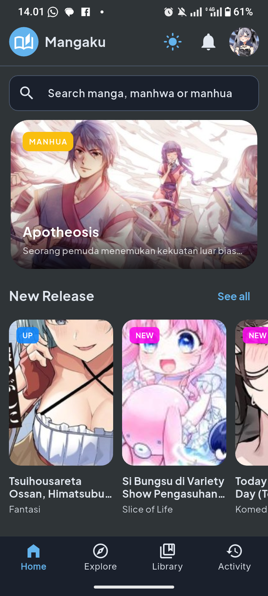
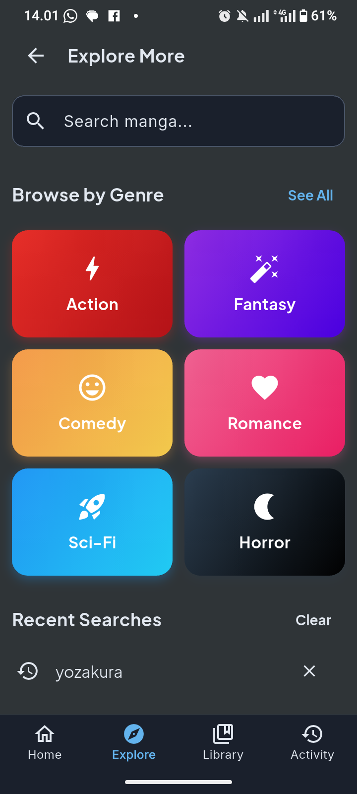
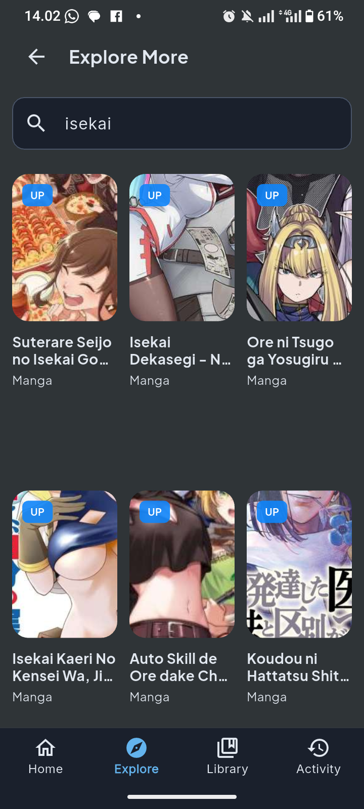
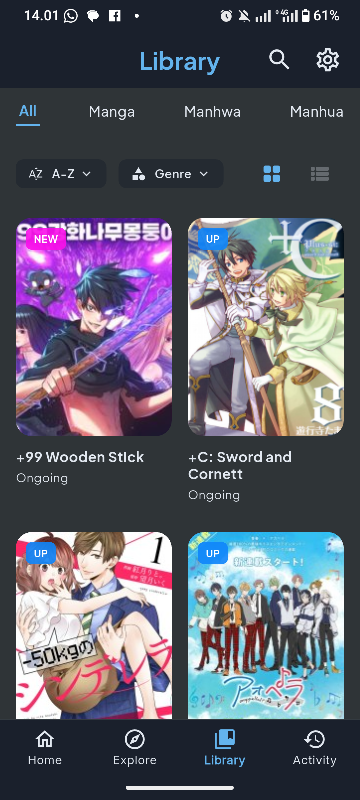
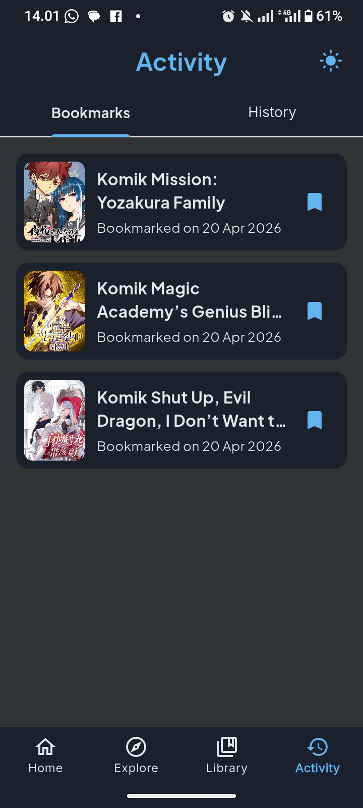

# Mangaku - Flutter Manga Reader App

Mangaku adalah aplikasi baca komik manga, manhwa, dan manhua yang dibangun dengan Flutter. Aplikasi ini memungkinkan pengguna untuk mencari, membookmark, dan membaca berbagai komik manga, manhwa, dan manhua secara native di perangkat mereka.

## Screenshots

<div align="center">
  <table style="border: none;">
    <tr>
      <td align="center">
        <br />
        <sub><b>Splash Screen</b></sub>
      </td>
      <td align="center">
        <br />
        <sub><b>Light Mode</b></sub>
      </td>
      <td align="center">
        <br />
        <sub><b>Dark Mode</b></sub>
      </td>
    </tr>
    <tr>
      <td align="center">
        <br />
        <sub><b>Search</b></sub>
      </td>
      <td align="center">
        <br />
        <sub><b>Search Result</b></sub>
      </td>
      <td align="center">
        <br />
        <sub><b>Library</b></sub>
      </td>
    </tr>
    <tr>
      <td align="center" colspan="3">
        <br />
        <sub><b>Activity/History</b></sub>
      </td>
    </tr>
  </table>
</div>

## Fitur

- **Home & Discovery**: Browse popular, latest, and recommended manga dengan mudah.
- **Search & Filter**: Cari judul tertentu atau filter berdasarkan genre.
- **Library**: Pengelompokan komik berdasarkan jenisnya (manga, manhwa, manhua) dan diurutkan berdasarkan popularitas atau update terbaru.
- **Reading Experience**: ada mode dark mode untuk membaca komik.
- **Activity Tracking**:
  - **Bookmarks**: Simpan komik favoritmu untuk dibaca nanti.
  - **Reading History**: Otomatis melacak bab terakhir yang dibaca dan langsung mengembalikan di mana kamu terakhir membaca.
- **Offline Database**: Menggunakan SQLite (via Drift) untuk menyimpan bookmark dan riwayat baca secara lokal.

## Tech Stack & Libraries

- **Framework**: Flutter (Dart)
- **State Management**: Provider
- **Networking**: Chopper (Retrofit-style HTTP client)
- **Local Database**: Drift (SQLite for Flutter)
- **Image Loading & Caching**: CachedNetworkImage
- **UI Themes**: Custom ZenTheme architecture for consistent dark mode aesthetics.

## Struktur Project

```text
lib/
├── database/     # Drift SQLite database
├── models/       # Data models and JSON serialization
├── providers/    # State management providers
├── screens/      # Application routes and main pages
├── services/     # Chopper API services configuration
├── themes/       # App typography, colors, and global themes
├── widgets/      # UI components
└── main.dart     # Entry point and dependency injection setup
```

## Memulai

Ikuti langkah-langkah berikut untuk membangun dan menjalankan aplikasi secara lokal:

1. **Clone repository**
2. **Install dependencies**:
   Jalankan `flutter pub get` di terminal.
3. **Environment Setup**:
   Buat file `.env` di root directory dan tambahkan API Base URL:
   ```env
   BASE_URL=https://your-api-url.com
   ```
4. **Code Generation** (if modifying database or API services):
   Jalankan `dart run build_runner build -d` untuk regenerate Drift and Chopper files.
5. **Run the App**:
   Execute `flutter run` untuk menjalankan aplikasi di emulator atau perangkat yang terhubung.

## Catatan

semua gambar komik yang dibaca di project ini akan disimpan pada cached memory hp perangkat sehingga tidak menyebab kan perangkat kalian mengload semua component secara bersamaan serta penggunaan lazy loading sehingga tidak akan memakan kuota internet kalian saat membacanya kembali
